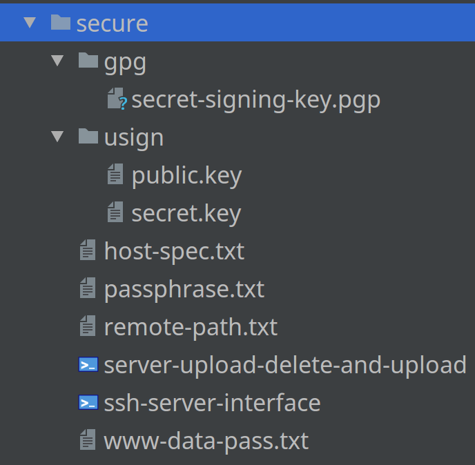

[//]: #@corifeus-header

  [](https://travis-ci.org/patrikx3/openwrt-insomnia)  [](https://scrutinizer-ci.com/g/patrikx3/openwrt-insomnia/?branch=master)  [](https://scrutinizer-ci.com/g/patrikx3/openwrt-insomnia/?branch=master) 

# Latest Stable OpenWrt Version with additional packages/feeds


## The latest OpenWrt is highly EXPERIMENTAL !!!
                    
 
                        
[//]: #@corifeus-header:end


## Linksys WRT3200ACM Winbond

The info is here:  
https://cdn.corifeus.com/openwrt/SNAPSHOT/


### Issues
[README](docs/issues.md)


### Build info
Always check out the original image builder if it changed (like sources urls).


# OpenWrt Latest Stable build with latest NodeJs 9, always the latest Kaloz mwlwifi's WIFI driver, latest Redis 4 stable, MariaDB 10

... and many pre-built packages and firmwares, image builder, Linksys WR1900ACS/WRT3200ACM, D-Link DIR860L B1 and RPI-3 is already built, but based on the READMEs, you can built a new one easy.  


## RPI-3

It is only re-built per request, given I do not use it.

## The following CPU-s are fully built

* arm_cortex-a9_vfpv3 (arm a9)
* mipsel_24kc (mipsel)
* aarch64_cortex-a53 (arm a53) - per request

***There are at least 5500 packages built per target (but more just I decreased 200 counts, because there are the signatures etc).***

### The packages that are pre-built in all ```insomnia``` firmwares

* luci-mod-admin-full
* luci ssl
* luci-app-firewall
* luci-app-openvpn
* luci-app-samba
* luci-app-upnp
* luci-app-wol
* luci-theme-bootstrap
* firewall
* dropbear
* ca-certificates
* nano
* ncdu
* bash
* miniupnpd
* watch
* whereis 
* curl
* git
* git-http
* midnight commander
* wget
* openvpn
* samba server
* openssh-sftp-server
* openvpn-easy-rsa
* openvpn-openssl
* rsync
* rsyncd
* logrotate
* tar
* whereis
* wpad & hostapd-utils so you can use ***WPS*** 
* all required packages are built so you are able to create an ```ext-root```
* and all packages have luci settings as well


Besides, all packages are there, like:  

* samba client
* nginx - full
* apache - full
* php 7.2
* python 2 and 3
* redis 4
* msmtp
* mariadb 10
* nodejs v9 latest
* But **everything** is built, actually.

I cant's list all of it, there is enough for now. See what is in [create from scratch](docs/create-from-scratch.md).

[Redis 4 is here!](https://cdn.corifeus.com/openwrt/SNAPSHOT/packages/arm_cortex-a9_vfpv3/redis/)

[MariaDB 10 is here!](https://cdn.corifeus.com/openwrt/SNAPSHOT/packages/arm_cortex-a9_vfpv3/mariadb/)

# NODE.JS INFO

By now, ```dbus``` and ```avahi-daemon``` is enabled by default in the firmwares.

## Based on
https://github.com/nxhack/openwrt-node-packages#note-about-avahi-and-homebridge


# Routers pre-built

If you want to install right away with LUCI:
https://cdn.corifeus.com/openwrt/SNAPSHOT/

## The release

* Linksys WRT1900ACS-latest-mwlwifi / Linksys WRT3200ACM-latest-mwlwifi
  * For Linksys the firmwares that start with ```insomnia-latest-mwlwifi``` worth trying, because your WIFI is will be flying.   
  * https://cdn.corifeus.com/openwrt/SNAPSHOT/targets/mvebu/cortexa9/
    * If you get the error ```The uploaded image file does not contain a supported format. Make sure that you choose the generic image format for your platform.```, you have to do it via SSH with ```sysupgrade -F FIRMWARE```, then it works. 
    * If you have a bricked firmware, you need a USB-TTL. [Linksys USB-TTL](docs/linksys-usb-ttl.md).
    * Error code: 18005
      * When trying to install a firmware image, I get the following error:
        * Error code: 18005, Upgrade unsuccessfully because the version of the upgraded file was incorrect. Please check the file name.
      * Solution: Rename the firmware image to something short, like e.g. factory.bin
        * Based on 
https://openwrt-project.org/faq/before_installation#error_code18005
* D-Link DIR-860l B1
  * https://cdn.corifeus.com/openwrt/SNAPSHOT/targets/ramips/mt7621/
    * If it is not working, with D-Link DIR-860l B1, you have to reset the router and re-load the firmware via emergency upload, like this
      1. Plug the Ethernet cable that connects your computer, that was plugged into one of the LAN ports, 
      1. Setup your PC with static IP - ex: 192.168.0.2 (different from 192.168.0.1), the gateway is 192.168.0.1, netmask 255.255.255.0
      1. Make sure the PC has the new firmware 
      1. Turn off the router
      1. Hold the reset button (in the bottom, there is a small whole for like a needle, it says RESET).
      1. Turn on the router and wait for like 3-5 seconds, the orange will flash, like turning off.
      1. Open a web browser to 192.168.0.1 and then you should see EMERGENCY FLASHING page then click browse/upload locate the file and click UPLOAD FIRMWARE NOW.
      1. For me, for first upload it doesn't do anything, I just click UPLOAD again and then it start uploading.
      1. You should see a SUCCSESS page, 
      1. You will have to wait until like 150 seconds.
      1. When it is green, you can turn off the static settings for the ethernet and enable DHCP.
      1. The you can open with 192.168.1.1, no password at all, you got LUCI and SSH as well.
      1. It works for sure, it's not like Linksys WRT, that you need an USB-TTL cable…
* RPI-3
  * https://cdn.corifeus.com/openwrt/SNAPSHOT/targets/brcm2708/bcm2710/
  * I don't have a RPI-3 in my hand, so I cannot test it, but a dude asked to build this, so he use it.


## If you want some of the packages

```text
/cgi-bin/luci/admin/system/packages/ipkg
```

### Linksys WRT or compatible alike mvebu / arm 9 (arm_cortex-a9_vfpv3)

```text
src/gz insomnia_core http://cdn.corifeus.com/openwrt/SNAPSHOT/targets/mvebu/cortexa9/packages
src/gz insomnia_base http://cdn.corifeus.com/openwrt/SNAPSHOT/packages/arm_cortex-a9_vfpv3/base
src/gz insomnia_luci http://cdn.corifeus.com/openwrt/SNAPSHOT/packages/arm_cortex-a9_vfpv3/luci
src/gz insomnia_mariadb http://cdn.corifeus.com/openwrt/SNAPSHOT/packages/arm_cortex-a9_vfpv3/mariadb
src/gz insomnia_node http://cdn.corifeus.com/openwrt/SNAPSHOT/packages/arm_cortex-a9_vfpv3/node
src/gz insomnia_packages http://cdn.corifeus.com/openwrt/SNAPSHOT/packages/arm_cortex-a9_vfpv3/packages
src/gz insomnia_redis http://cdn.corifeus.com/openwrt/SNAPSHOT/packages/arm_cortex-a9_vfpv3/redis
src/gz insomnia_routing http://cdn.corifeus.com/openwrt/SNAPSHOT/packages/arm_cortex-a9_vfpv3/routing
src/gz insomnia_telephony http://cdn.corifeus.com/openwrt/SNAPSHOT/packages/arm_cortex-a9_vfpv3/telephony
```

### D-Link DIR860L B1 or compatible mipsel (mipsel_24kc)

```text
src/gz insomnia_core http://cdn.corifeus.com/openwrt/SNAPSHOT/targets/ramips/mt7621/packages
src/gz insomnia_base http://cdn.corifeus.com/openwrt/SNAPSHOT/packages/mipsel_24kc/base
src/gz insomnia_luci http://cdn.corifeus.com/openwrt/SNAPSHOT/packages/mipsel_24kc/luci
src/gz insomnia_mariadb http://cdn.corifeus.com/openwrt/SNAPSHOT/packages/mipsel_24kc/mariadb
src/gz insomnia_node http://cdn.corifeus.com/openwrt/SNAPSHOT/packages/mipsel_24kc/node
src/gz insomnia_packages http://cdn.corifeus.com/openwrt/SNAPSHOT/packages/mipsel_24kc/packages
src/gz insomnia_redis http://cdn.corifeus.com/openwrt/SNAPSHOT/packages/mipsel_24kc/redis
src/gz insomnia_routing http://cdn.corifeus.com/openwrt/SNAPSHOT/packages/mipsel_24kc/routing
src/gz insomnia_telephony http://cdn.corifeus.com/openwrt/SNAPSHOT/packages/mipsel_24kc/telephony
```
### R-PI 3 or compatible arm (aarch64_cortex-a53)

```text
src/gz insomnia_core http://cdn.corifeus.com/openwrt/SNAPSHOT/targets/brcm2708/bcm2710/packages
src/gz insomnia_base http://cdn.corifeus.com/openwrt/SNAPSHOT/packages/aarch64_cortex-a53/base
src/gz insomnia_luci http://cdn.corifeus.com/openwrt/SNAPSHOT/packages/aarch64_cortex-a53/luci
src/gz insomnia_mariadb http://cdn.corifeus.com/openwrt/SNAPSHOT/packages/aarch64_cortex-a53/mariadb
src/gz insomnia_node http://cdn.corifeus.com/openwrt/SNAPSHOT/packages/aarch64_cortex-a53/node
src/gz insomnia_packages http://cdn.corifeus.com/openwrt/SNAPSHOT/packages/aarch64_cortex-a53/packages
src/gz insomnia_redis http://cdn.corifeus.com/openwrt/SNAPSHOT/packages/aarch64_cortex-a53/redis
src/gz insomnia_routing http://cdn.corifeus.com/openwrt/SNAPSHOT/packages/aarch64_cortex-a53/routing
src/gz insomnia_telephony http://cdn.corifeus.com/openwrt/SNAPSHOT/packages/aarch64_cortex-a53/telephony
```
# Signatures

## If you do not want to have the hassle, there are multiple solutions below.

If you use an ```insomnia``` firmware, then you are done, but if you want one or more feeds from a non ```insomnia``` firmware, your router still needs a verified signature.

### If you just use one or a few feeds non insomnia firmware, your router needs a signature

You need to copy this file from this directory:  
https://github.com/patrikx3/openwrt-insomnia/tree/master/image-builder-files/etc/opkg/keys to    
```text
 /etc/opkg/keys
```

### Option 2

The easiest solution I know is via LUCI :  
[http://192.168.1.1/cgi-bin/luci/admin/system/packages/ipkg](http://192.168.1.1/cgi-bin/luci/admin/system/packages/ipkg)    
  
In the **Configuration** tab, comment like this:  
```#option check_signature 1```

### Option 3 manual with SSH
  
You can also set it up via SSH as:
```text
root@digi:~# cat /etc/opkg.conf
dest root /
dest ram /tmp
lists_dir ext /var/opkg-lists
option overlay_root /overlay
#option check_signature 1
```  

Just edit there, ```nano``` is installed, just comment the ```option check_signature 1``` as it shows above.
  

### Generate real signatures, do not need ```#option check_signature 1``` 

Everything is verified.

I have my own GPG and USIGN. So the [http://cdn.corifues.com/openwrt](http://cdn.corifues.com/openwrt) it works with signatures by now.

But if you want to build your own firwmare based on ```insomnia```, you need to create your own GPG and USIGN, you can generate like this:  
https://openwrt-project.org/docs/user-guide/keygen
 
A few small info is here [info](docs/openwrt-generate-gpg-and-usign.md).
 
So to build with ```insomnia``` you need to place some files like above. 
 
The ```openwrt-insomnia/image-builder-files/etc/opkg/keys/xxxxxxx``` is your USIGN actual public.key with the hash name, it builds into the firmware, the description in the link just above coming right away, says how to generate that file.    
The ``openwrt-insomnia/secure/gpg/secret-signing-key.pgp`` and ```secure/usign``` needs the ```public.key``` and ```secret.key```. 
You also need to add in ```openwrt-insomnia/secure/passphrase.txt```, which is your GPG passphrase. If this is added in, you can sign everything.

Right now, it is not found to automatic use the passphrase for ```gpg```, so you have to type it in for the passphrase.

Before it asks for the passphrase, it will show on the terminal so you copy and then just paste it. It will as twice.

They files to generate are in the same link above. So, if you want to sign, you might need to contact to me.

 

If you have this signed gpg and usign data and keys, I can help you to signed firmwares and packages.


## Ext-root issue

### Solution 1
If you use for example:  
 https://cdn.corifeus.com/openwrt/version/arhitecture/target/type/file-firmware-squashfs-sysupgrade.bin 
 
So it is a **sysypgrade -F** firmware. Then I can re-use the old ```ext-root```, that I had before. Actually it only works with the Linksys WRT 3200ACM, with Linksys WRT 1200ACS it was not working, but maybe it still work, I don't know, it could be something changed that made it not work. :) 
 
But, if you use a factory, like:  
https://cdn.corifeus.com/openwrt/version/arhitecture/target/type/file-firmware-squashfs-factory.bin

Then it doesn't work, you have to re-build to ```ext-root```. 

There is a ```Solution 2```, but for me it didn't work, but by using a ***sysupgrade*** firmware. It will re-use the ```ext-root```.

### Solution 2 

If you have ```ext-root``` before ```sysupgrade``` you need to execute ```rm -f /overlay/etc/.extroot-uuid```. After restart, please ```reboot``` again and it works. 

Based on:  
https://forum.openwrt-project.org/t/solved-sd-card-extroot-stop-auto-mount-after-firmware-upgrade/4310/1

#### For me it is not working, I use solution 1.

## Wifi and WPS Issue

It is only working, if only these are built in the firmware: ```hostapd-common wpad-mini```, nothing other like that. If not, it will not work. [WPS](docs/wps.md) info.


## Docker

### Requirements

**Docker CE**

For your workstation you don't really NodeJs, but my Travis, Scrutinizer and my auto generated web sites are required...   
   
This is a OpenWrt Docker builder and a living Docker repo as well, ready to build, a lot already built.
(A big image / full firmware, the most important packages are built. Ready to use.)  

#### Changing the firmware pre-built, so the build will be fast!!!

All the latest stable OpenWrt versions.

* docker pull patrikx3/openwrt-insomnia:d-link-dir-860l-b1
* docker pull patrikx3/openwrt-insomnia:linksys-wrt
* docker pull patrikx3/openwrt-insomnia:rpi-3

* RAW
  * docker pull patrikx3/openwrt-insomnia:latest

You run them, but these here, the built is in: http://cdn.corifeus.com/openwrt/SNAPSHOT, all the built packages and firmwares in ```/build/source/bin```, you move to a host, install the firmware and you are done, because in the ```insomnia``` firmwares there is a lot in, but this is the default, so you need to change your own hostname here:
[http://192.168.1.1/cgi-bin/luci/admin/system/packages/ipkg](http://192.168.1.1/cgi-bin/luci/admin/system/packages/ipkg) at ```Configuration``` tab. If you do not want to build at all you can choose to your host  

All built packages and firmwares including the ```insomnia``` firmwares are in ```/build/source/bin```. 

[README about how I build the firmwares in order](docs/template-docker-commit.md)

# My repos    
   
https://hub.docker.com/r/patrikx3/openwrt-insomnia/tags/

https://cdn.corifeus.com/openwrt/  

# Linksys WRT Radar Detection
Tested on WRT1900ACSv2 and WRT3200ACM, works.  
[README](docs/linksys-wrt-radar-detection.md)

# Ext-Root
[README](docs/ext-root.md)

## How I built these Dockers via these links
[README](docs/links-i-used.md)

## Docker commands
[README](docs/docker-commands.md)

## Create packages, not neeed anymore
[My first package](docs/create-package.md)

## Use Fail2Ban on your router
[Fail2Ban though is for DDWRT, but it is the same to set it up with OpenWrt with some changes, if you need info, I can give you, just it is mine private git server because of passwords.](docs/fail2ban.md)


# Create from scratch
[README](docs/create-from-scratch.md)


# Copy configs
[README](docs/copy-test-configs.md)


# Firmware sizes
[README](docs/firmware-sizes.md)

# WPS
[README](docs/wps.md)

# Packages and patches

[README](docs/packages-patches.md)

# Linksys WRT 3200ACM 160 Mhz
[README](docs/linksys-wrt-3200acm-160mhz.md)

# Linksys USB-TTL
[README](docs/linksys-usb-ttl.md)

# Linksys WRT 3200ACM
For some reason it needs this:

```bash
# based on this https://truica-victor.com/dhcp-packet-received-eth0-2-address/
echo "except-interface=eth1" >> /etc/dnsmasq.conf
```

[//]: #@corifeus-footer

---

[**P3X-OPENWRT-INSOMNIA**](https://pages.corifeus.com/openwrt-insomnia) Build v18.0.45-239 

[](https://www.facebook.com/corifeus.software) [](https://www.paypal.com/cgi-bin/webscr?cmd=_s-xclick&hosted_button_id=QZVM4V6HVZJW6)  [](https://www.patrikx3.com/en/front/contact) 


## Sponsor

[](https://www.jetbrains.com/)
  
 

[//]: #@corifeus-footer:end


