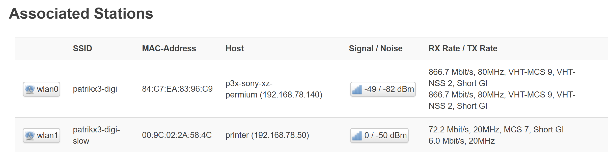

[//]: #@corifeus-header

## Latest Stable OpenWrt Version with additional packages/feeds

---
                        
[//]: #@corifeus-header:end

# Linksys WRT 3200ACM 160Mhz

You have to find out the channel that in your country was setup with the router is working.
For me, I am Hungarian, but the router is FR based in FRANCE in EUROPE (or European Linksys is usually is FR), the ```120 channel``` is working well.

But for now, it is using the ```radar detection``` and it is changing the channels and it works.

## Check status

```bash
iw reg get
iw dev
```

## Picture

 

## This is important

http://192.168.1.1/cgi-bin/luci/admin/network/wireless/radio0.network1

Below:
```Wireless scurity``` set ```Cipher``` to ```Force CCMP (AES)```.

```bash
reboot && exit
```

[//]: #@corifeus-footer

---

[**P3X-OPENWRT-INSOMNIA**](https://pages.corifeus.com/openwrt-insomnia) Build v18.0.14-120 

[](https://www.facebook.com/corifeus.software) [](https://www.paypal.com/cgi-bin/webscr?cmd=_s-xclick&hosted_button_id=QZVM4V6HVZJW6)  [](https://www.patrikx3.com/en/front/contact) 


## Sponsor

[](https://www.jetbrains.com/)
  
 

[//]: #@corifeus-footer:end